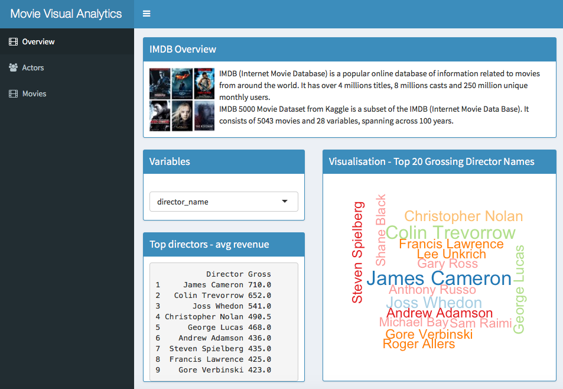
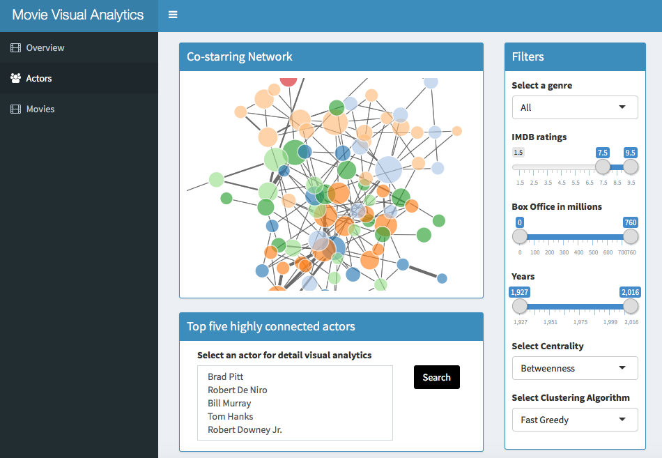
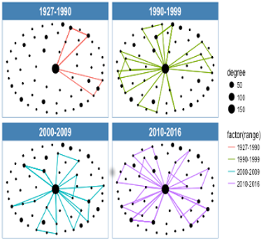
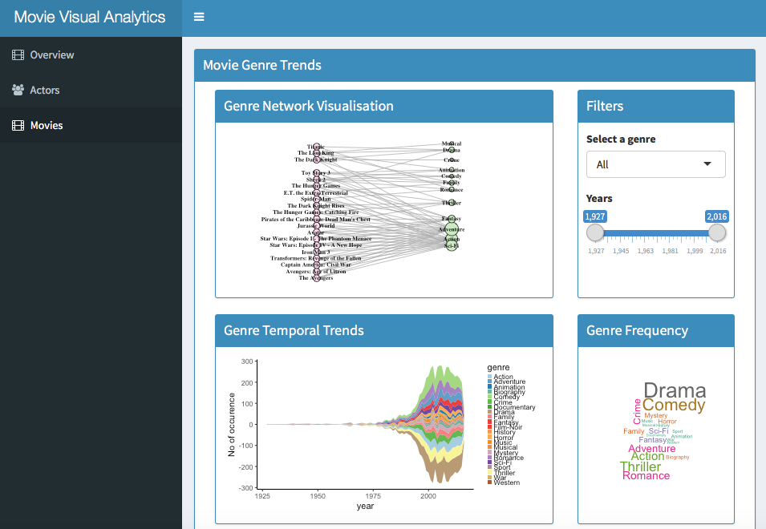

# Scalable Visual Analytics For Movie Data with R Shiny
This project presents design, implementation and evaluation of Scalable Visual Analytics framework for movie data. The design of the project consists of analysis, visualisation and interaction modules. The Analysis module provides centrality, clustering, time slice, collaboration and temporal dynamic. The Visualisation module generates node-link diagram, Wordcloud layout, Streamgraph, Sunburst diagram, Histogram, Line graph and stacked bar plot. The Interaction module allows zoom, filter, selection, interactive slider, hover, drag and click. The implementation of this project is the development of an interactive web application using R Shiny. There are two main tasks in the evaluation, to determine the most influential actors and to identify movie genre trends. To determine the most influential actors, interactive temporal dynamic networks and collaboration analysis are applied. Temporal dynamic two-mode networks are used to identify movie genre trends. This interactive web application developed for this project was able to provide fast and flexible solution for the tasks.

## There are three categories in the application:
### Overview

### Actor Page

#### Active timeslice

### Movie Page

